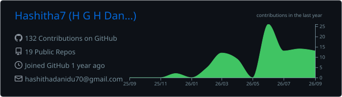
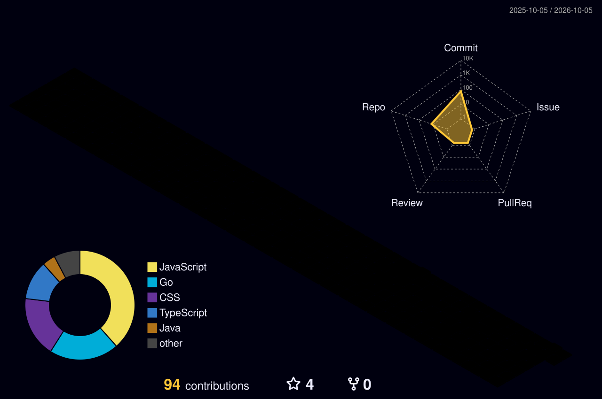
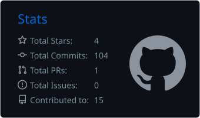
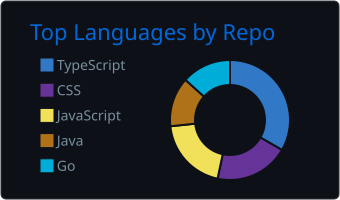
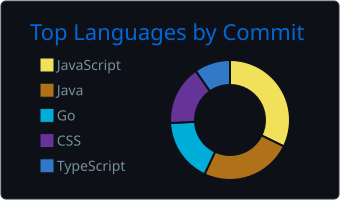
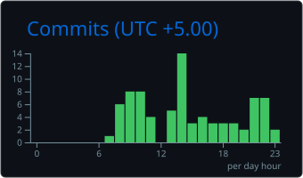

<!-- ============================================================
     Hashitha Danidu | GitHub Profile README
     Repo name must be exactly: Hashitha7  (Hashitha7/Hashitha7)
     ============================================================ -->

<div align="center">

<!-- ANIMATED HEADER -->


<!-- TYPING ANIMATION -->
<a href="https://hashitha.vercel.app/">
  
</a>

<br/>

<!-- PROFILE VIEWS + BADGES -->

<a href="https://hashitha.vercel.app/"></a>
<a href="https://www.linkedin.com/in/hashitha-danidu-532925346/"></a>
<a href="mailto:hashithadanindu10@gmail.com"></a>

</div>

<br/>

<!-- ROBOT / TERMINAL STYLE INTRO -->
<div align="center">

```text
┌──────────────────────────────────────────────────────────────┐
│  > SYSTEM.BOOT()                                             │
│  > LOADING PROFILE ................................ [ OK ]   │
│  > NAME        : H G Hashitha Danidu                         │
│  > ROLE        : Full Stack & AI Engineer                    │
│  > EDUCATION   : BSc (Hons) Software Engineering, SLIIT      │
│  > STARTUP     : Founder @ Tenzor LABS                       │
│  > LOCATION    : Sri Lanka                                   │
│  > STATUS      : Open to opportunities  [ ONLINE ]           │
└──────────────────────────────────────────────────────────────┘
```

</div>

---

## 🤖 About Me

<div align="center">


</div>

- 🎓 Software Engineering Fresh Graduate (SLIIT City Uni)
- 🧠 Passionate about **AI, LLMs & Machine Learning**
- 💻 **Full-stack** development with the MERN stack, Next.js & TypeScript
- ⚙️ Workflow automation with **n8n** and containerization with **Docker**
- ☁️ Exploring **Cloud & DevOps**
- 🚀 Founder and Owner @ **Tenzor LABS**: turning ideas into reliable, scalable products
- 🌏 Based in Sri Lanka | Fluent in Sinhala & English

---

## 🛠️ Tech Arsenal

<div align="center">

### Languages


### Frontend & Mobile


### Backend & Databases


### DevOps & Tools


### AI & Automation


</div>

---

## 👤 Profile Details

<div align="center">
  
</div>

---

## 🧊 3D Contribution Graph

<div align="center">
  
</div>

<!-- The image above appears after the GitHub Action (profile-animations.yml) runs once. -->

---

## 📊 GitHub Stats

<div align="center">





<br/>


</div>

---

## 🚀 Featured Projects

| # | Project | Description | Tech |
|---|---------|-------------|------|
| 00 | **[Tenzor LABS](https://tenzor-labs.vercel.app/)** | Official web platform for my startup: AI workflows, software development & client engineering services | Next.js, TypeScript, Three.js, Framer Motion, Tailwind |
| 01 | **[Modernistic LMS & AI Answer Analyst](https://lms-ai-answer-analyst-system.vercel.app/)** | Learning platform with an AI system that grades answers and gives feedback | React, Spring Boot, Python, Flask, NLP, JWT |
| 02 | **TestNova AI QA Platform** | AI-driven QA platform powered by Google Gemini for test generation & automation | Next.js, FastAPI, Gemini API, SQLAlchemy |
| 03 | **SuperMart POS** | Full-stack Point of Sale system with real-time analytics | Angular, Node.js, Express, SQLite, JWT |
| 04 | **Stock Management System** | Inventory & billing system built for a real client | React, Node.js, MySQL, Gemini, Ollama |
| 05 | **Banana Nexus Game** | Full-stack puzzle game with leaderboard | React, Spring Boot, MySQL |
| 06 | **Blockchain in Go** | Wallets, Merkle tree validation, concurrent mining, difficulty retargeting | Go |

> 🔗 Add your repo links to each project name once the repositories are public.

---

## ⏱️ Productive Time

<div align="center">
  
</div>

---

## 🐍 Snake Eating My Contributions

<div align="center">
  <picture>
    <source media="(prefers-color-scheme: dark)" srcset="https://raw.githubusercontent.com/Hashitha7/Hashitha7/output/github-snake-dark.svg" />
    <source media="(prefers-color-scheme: light)" srcset="https://raw.githubusercontent.com/Hashitha7/Hashitha7/output/github-snake.svg" />
    
  </picture>
</div>

---

## 📫 Let's Connect

<div align="center">

<a href="https://hashitha.vercel.app/"></a>
<a href="https://www.linkedin.com/in/hashitha-danidu-532925346/"></a>
<a href="mailto:hashithadanindu10@gmail.com"></a>

<br/><br/>


</div>
